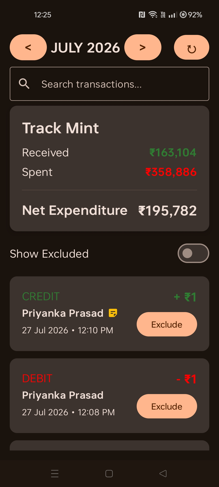
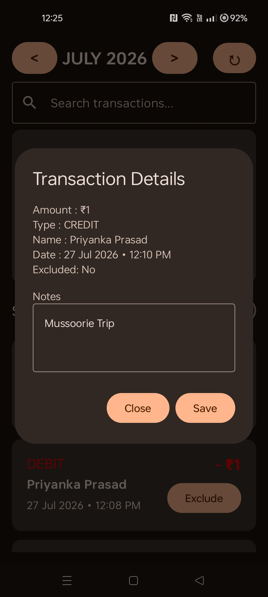

<h1>
  
  TrackMint
</h1>

An Android application that automatically tracks expenses by reading bank SMS notifications and storing them locally. The app eliminates manual expense entry and provides an intuitive interface for searching, organizing, and managing transactions.

---

# ✨ Features

- 📩 Automatic SMS transaction detection
- 💾 Offline storage using Room Database
- 🔄 One-click SMS synchronization
- 📅 Monthly transaction filtering
- 🔍 Search transactions by
    - Name
    - Amount
    - Date
    - Type
- 💸 Monthly expenditure summary
    - Total Received
    - Total Spent
    - Net Expenditure
- 🚫 Include / Exclude transactions from calculations
- 📝 Add personal notes to every transaction
- 📌 Notes indicator on transactions
- 📄 Detailed transaction view
- 🎨 Material 3 UI built with Jetpack Compose

---

# 📸 Screenshots

### 🏠 Home Screen
Displays monthly transactions, expenditure summary, search functionality, and synchronization options.

<p align="center">
  
</p>

---

### 📄 Transaction Details
View complete transaction information, add personal notes, and manage transaction details.

<p align="center">
  
</p>

---

# 🛠 Tech Stack

- Kotlin
- Jetpack Compose
- Room Database
- Material 3
- Kotlin Coroutines
- Android SMS API

---

# 🏗 Architecture

```
SMS Inbox
      │
      ▼
 SMS Parser
      │
      ▼
 Room Database
      │
      ▼
 Repository
      │
      ▼
 Jetpack Compose UI
```

---

# 📂 Project Structure

```
app/
│
├── DatabaseProvider.kt
├── ExpenseDatabase.kt
├── Transaction.kt
├── TransactionDao.kt
├── TransactionRepository.kt
├── TransactionSyncManager.kt
│
├── SmsParser.kt
├── SmsReader.kt
├── SmsReceiver.kt
│
├── MainActivity.kt
├── TransactionDetailsDialog.kt
│
└── ui.theme/
```

---

## 📥 Download

You can download the latest APK from the **Releases** page.

➡️ **Download here:** https://github.com/Pratyush0206/TrackMint/releases/latest

---

## ⚠️ Installation

TrackMint reads bank SMS messages to automatically detect and record transactions. Because of this, Google Play Protect may warn that the app can access sensitive data.

### Installation Steps

1. Download the latest APK from the Releases page.
2. Open the downloaded APK.
3. If prompted, allow installation from your browser or file manager.
4. If Google Play Protect blocks the installation:
    - Tap **More details**.
    - Select **Install anyway** (if available).

If installation is still blocked:

1. Open the **Google Play Store**.
2. Tap your **profile picture** → **Play Protect**.
3. Tap the **Settings (⚙️)** icon.
4. Turn **Scan apps with Play Protect** **OFF** temporarily.
5. Install the TrackMint APK.
6. Re-enable Play Protect after installation.

> **Note:** TrackMint is completely open source. You can inspect the source code in this repository before installing.

---

# 📖 How It Works

1. Reads bank SMS messages after permission is granted.
2. Parses debit and credit transactions automatically.
3. Stores transactions locally using Room Database.
4. Allows users to:
    - Search transactions
    - Filter by month
    - Exclude transactions
    - Add personal notes
5. Updates expenditure statistics instantly.

---

# 🔮 Future Improvements

- Expense categories
- Charts & analytics
- Budget planner
- Export to CSV/PDF
- Cloud backup
- Recurring transaction detection
- Home screen widget

---

# 👨‍💻 Author

**Pratyush Prasad**

---
